# Implementation architecture

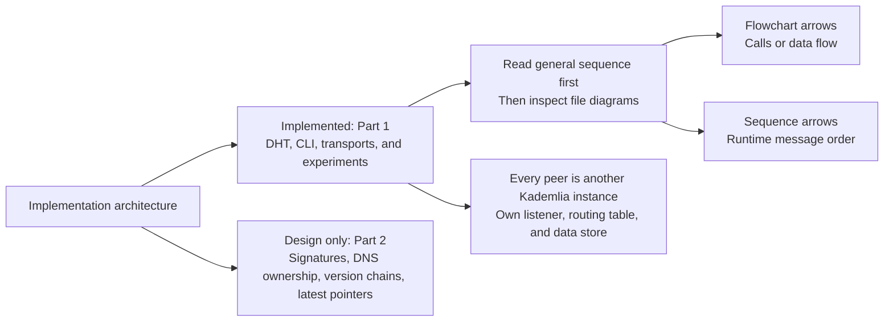

[Part 2 design](PART2-DESIGN.md)

## Diagram index

- [General functionality](#general-functionality)
- [File relationships](#file-relationships)
- [kademlia.go: operations and state](#kademliago-operations-and-state)
- [kademlia.go: parallel lookup](#kademliago-parallel-lookup)
- [kademlia.go: joining and refresh](#kademliago-joining-and-refresh)
- [kademlia.go: replication](#kademliago-replication)
- [network.go: transport implementations](#networkgo-transport-implementations)
- [network.go: simulated delivery](#networkgo-simulated-delivery)
- [routingtable.go: routing tree](#routingtablego-routing-tree)
- [bucket.go: contact recency](#bucketgo-contact-recency)
- [contact.go and kademliaid.go: identity and distance](#contactgo-and-kademliaidgo-identity-and-distance)
- [CLI: cmd/simshell/main.go](#cli-cmdsimshellmaingo)
- [Experiments: main.go and resilience.go](#experiments-maingo-and-resiliencego)
- [Deployment and tests](#deployment-and-tests)

## General functionality

[CLI](cmd/simshell/main.go) · [Kademlia operations](kademlia/kademlia.go) · [Transports](kademlia/network.go)

```mermaid
sequenceDiagram
    actor User
    participant CLI as CLI / shell
    participant Local as Local Kademlia node
    participant RT as Local routing table
    participant Transport as Node transport
    participant Peer as Remote Kademlia peer
    participant DS as Peer data store

    Note over Local,Peer: Nodes already have running ListenForRPC loops
    User->>CLI: put FILENAME
    CLI->>Local: Store(file bytes)
    Local->>Local: Check size and compute SHA-256 key
    Local->>RT: Find contacts closest to key
    RT-->>Local: Initial shortlist
    loop Discovery rounds with up to alpha parallel probes
        Local->>Transport: Send FIND_NODE with request ID
        Transport->>Peer: Deliver JSON RPC
        Peer-->>Transport: FIND_NODE_REPLY with contacts
        Transport-->>Local: Match request ID and deliver contacts
        Local->>RT: Learn discovered contacts
    end
    loop Up to K selected replicas
        alt Replica is the local node
            Local->>Local: Store a copy under its hash
        else Replica is a remote peer
            Local->>Transport: Send STORE with key and bytes
            Transport->>Peer: Deliver STORE
            Peer->>Peer: Check value size and hash
            Peer->>DS: Save valid value
            Peer-->>Transport: STORE_REPLY accepted or rejected
            Transport-->>Local: Complete pending STORE request
        end
    end
    Note over Local,Peer: Remote STORE requests run concurrently; wait for all attempts
    Note over Local,Peer: Store succeeds when at least one selected replica accepts
    Local-->>CLI: Key, or error if no replica accepted
    CLI-->>User: Print key

    User->>CLI: get KEY FILENAME
    CLI->>Local: LookupData(key)
    alt Valid value exists locally
        Local-->>CLI: Value bytes
    else Remote lookup is needed
        loop Probe nearest candidates in parallel rounds
            Local->>Transport: Send FIND_VALUE with request ID
            Transport->>Peer: Deliver FIND_VALUE
            Peer->>DS: Look up key
            DS-->>Peer: Value or missing
            Peer-->>Transport: FIND_VALUE_REPLY with value or contacts
            Transport-->>Local: Complete matching pending request
            Local->>Local: Verify returned size and SHA-256
        end
        Local-->>CLI: First valid value, or not-found error
    end
    CLI-->>User: Write verified bytes to file
```

## File relationships

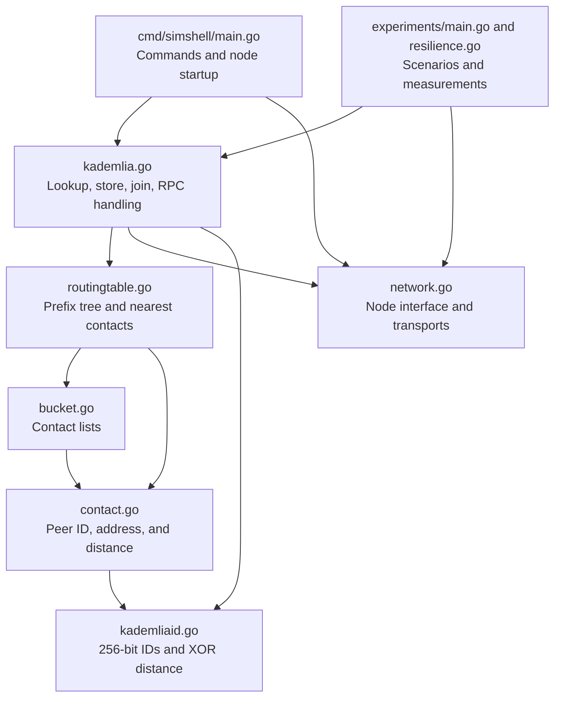

## kademlia.go: operations and state

[kademlia.go](kademlia/kademlia.go)

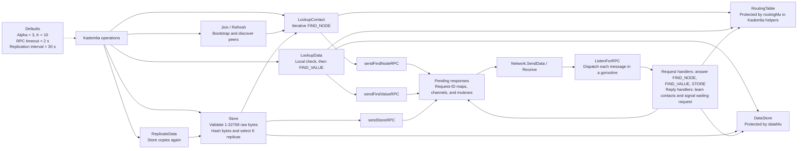

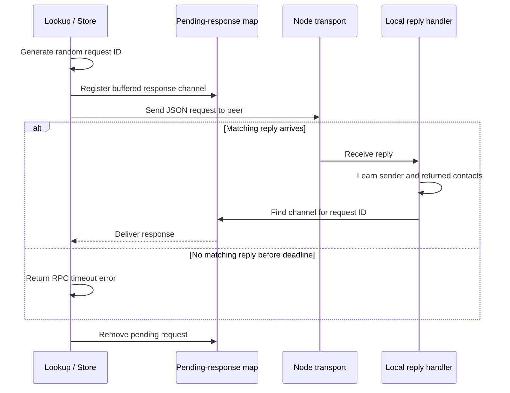

## kademlia.go: parallel lookup

[kademlia.go](kademlia/kademlia.go)

```mermaid
sequenceDiagram
    participant Lookup as LookupContact
    participant RT as Routing table
    participant A as Peer A
    participant B as Peer B
    participant C as Peer C

    Lookup->>RT: Initial contacts nearest target by XOR distance
    RT-->>Lookup: Shortlist
    loop While shortlist has unqueried contacts
        Note over Lookup,C: Example batch with alpha = 3
        par Probe A
            Lookup->>A: FIND_NODE target, request ID A
            A-->>Lookup: Matching reply with contacts
        and Probe B
            Lookup->>B: FIND_NODE target, request ID B
            B-->>Lookup: Matching reply with contacts
        and Probe C
            Lookup->>C: FIND_NODE target, request ID C
            Note over Lookup,C: If no matching reply arrives, this probe times out
        end
        Lookup->>Lookup: Wait for every probe in this round
        Lookup->>Lookup: Merge replies, remove duplicates, sort by XOR distance
        Lookup->>Lookup: Keep nearest candidates and mark queried IDs
    end
    Lookup-->>Lookup: Return nearest known contacts
    Note over Lookup,C: Timed-out peers can remain known candidates; returned contact does not prove liveness
```

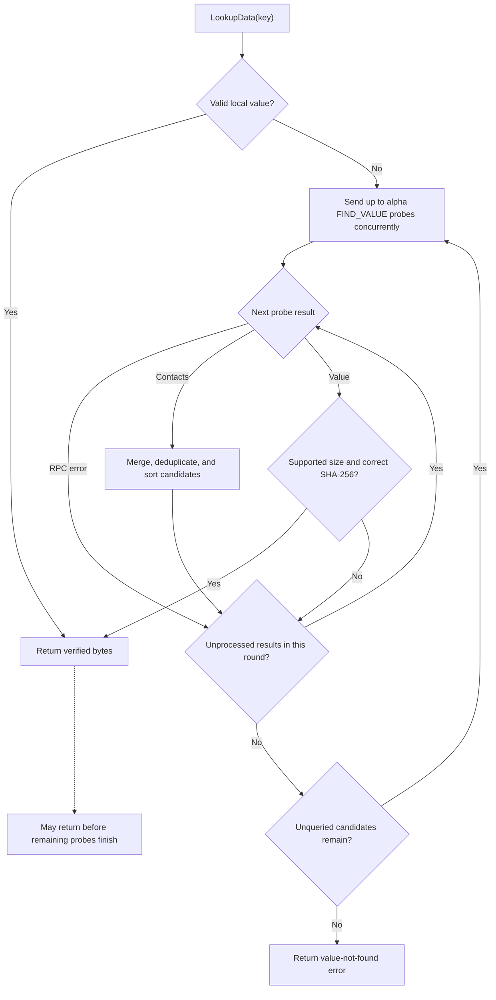

## kademlia.go: joining and refresh

[kademlia.go](kademlia/kademlia.go)

```mermaid
sequenceDiagram
    participant Startup as CLI startup
    participant Joiner as Joining node
    participant RT as Joining node routing table
    participant Peers as Bootstrap and discovered peers

    Startup->>Joiner: Start ListenForRPC
    Startup->>Joiner: Join(bootstrap contact)
    Joiner->>Joiner: Validate local setup and bootstrap contact
    Joiner->>RT: Add bootstrap contact
    Joiner->>Peers: LookupContact(local node ID)
    Peers-->>Joiner: FIND_NODE replies
    Joiner->>RT: Learn neighbors from replies
    loop XOR-distance ranges 0 through 255
        Note over Joiner,RT: Range indices differ from dynamically allocated routing-tree leaf indices
        Joiner->>Joiner: Refresh(index)
        Joiner->>Joiner: Copy local ID and flip the indexed bit
        Joiner->>Joiner: Randomize less significant bits
        Joiner->>Peers: LookupContact(random target in that range)
        Peers-->>Joiner: Contacts or probe timeout
        Joiner->>RT: Learn replying peers and returned contacts
    end
    Joiner-->>Startup: Join returns
    Note over Startup,Peers: Lookup failures are not propagated; nil does not guarantee a responsive bootstrap
```

## kademlia.go: replication

[kademlia.go](kademlia/kademlia.go)

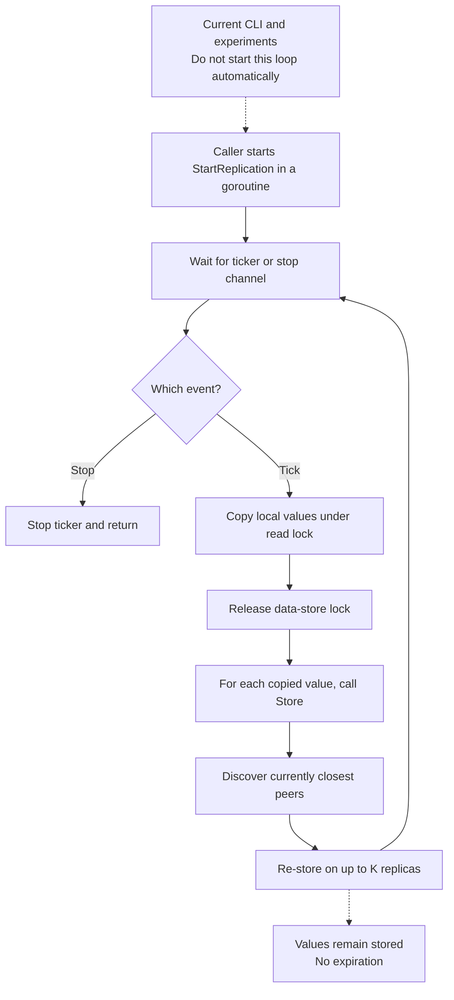

## network.go: transport implementations

[network.go](kademlia/network.go)

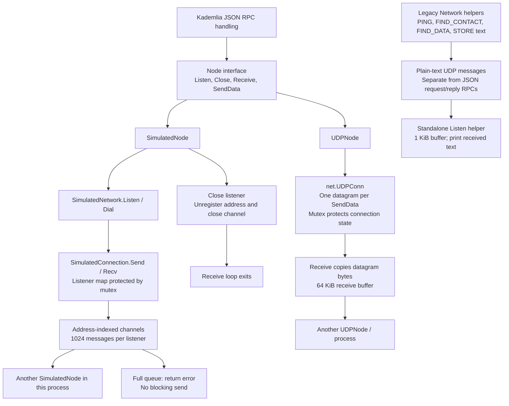

## network.go: simulated delivery

[network.go](kademlia/network.go)

```mermaid
sequenceDiagram
    participant KA as Kademlia node A
    participant A as SimulatedNode A
    participant Bus as Shared SimulatedNetwork
    participant Q as Node B channel
    participant B as SimulatedNode B
    participant KB as Kademlia node B
    Note over A,Bus: Addresses identify in-memory listeners; no UDP ports are bound
    Note over KA,KB: Same transport used by the 1000-node test

    B->>Bus: Listen(address B)
    Bus->>Q: Register buffered listener channel
    KA->>A: SendData(address B, JSON bytes)
    A->>Bus: Dial(address B)
    Bus-->>A: Sending connection
    A->>Q: Connection.Send(Message with From, To, Data)
    A->>Bus: Close sending connection
    B->>Q: Receive / Connection.Recv
    Q-->>B: Message
    B-->>KB: Receive returns message
    KB->>KB: Dispatch RPC handler in a goroutine
    KB->>B: SendData(address A, reply bytes)
    Note over A,B: Reply follows the same channel-routing path in reverse
    A-->>KA: Receive reply and match request ID
```

## routingtable.go: routing tree

[routingtable.go](kademlia/routingtable.go)

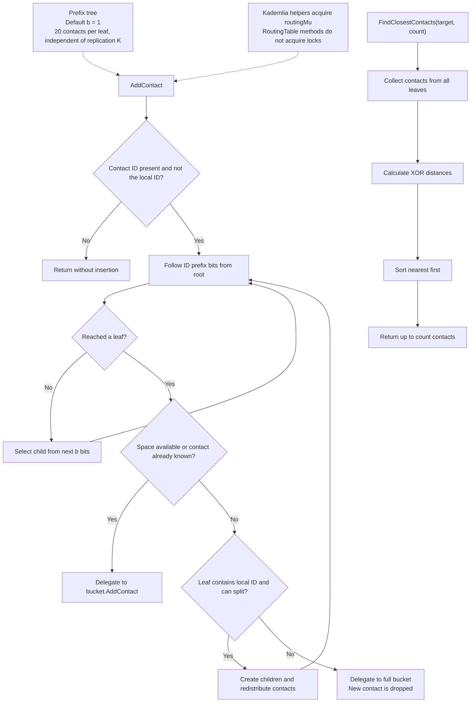

## bucket.go: contact recency

[bucket.go](kademlia/bucket.go)

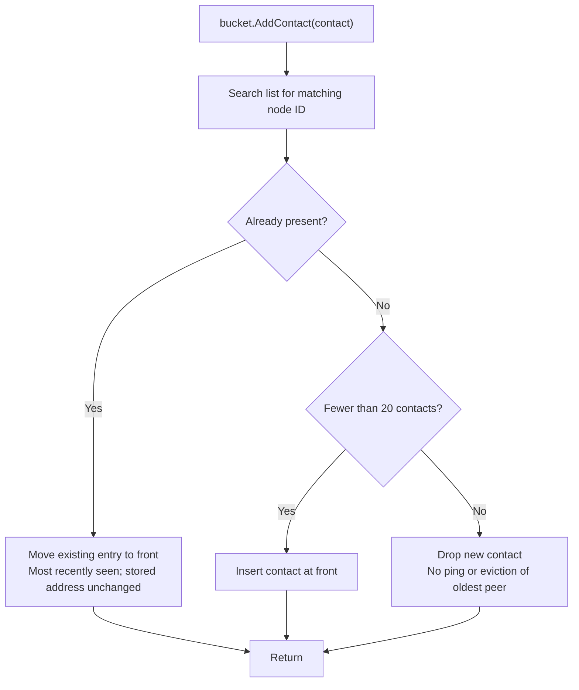

## contact.go and kademliaid.go: identity and distance

[contact.go](kademlia/contact.go) · [kademliaid.go](kademlia/kademliaid.go) · [CLI](cmd/simshell/main.go)

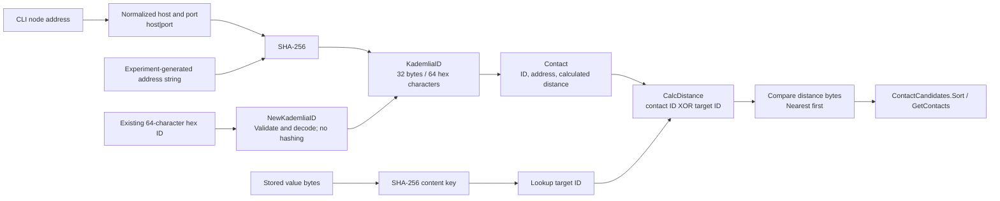

## CLI: cmd/simshell/main.go

[cmd/simshell/main.go](cmd/simshell/main.go)

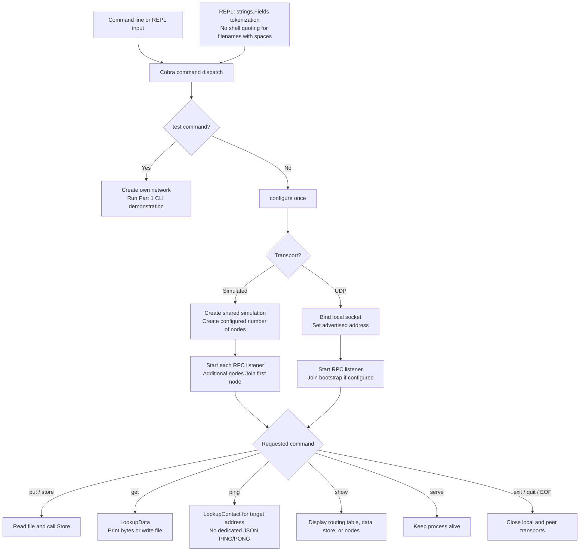

## Experiments: main.go and resilience.go

[experiments/main.go](experiments/main.go) · [experiments/resilience.go](experiments/resilience.go) · [Experiment documentation](experiments/README.md)

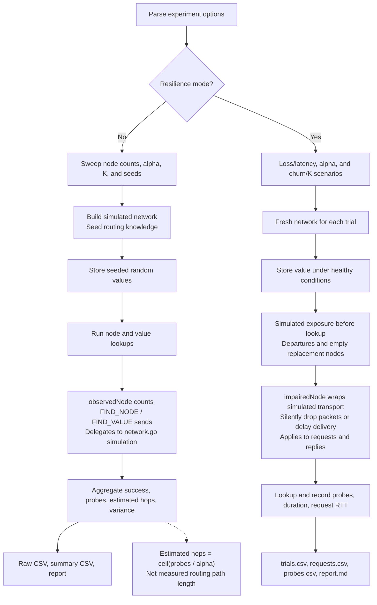

## Deployment and tests

[docker-compose.yml](docker-compose.yml) · [kademlia_test.go](kademlia/kademlia_test.go) · [value_size_test.go](kademlia/value_size_test.go) · [CI workflow](../.github/workflows/ci.yml)

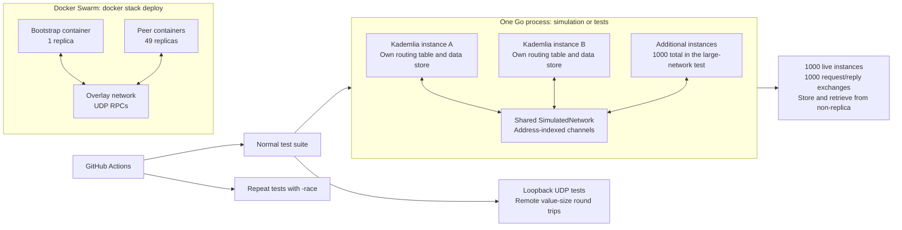
