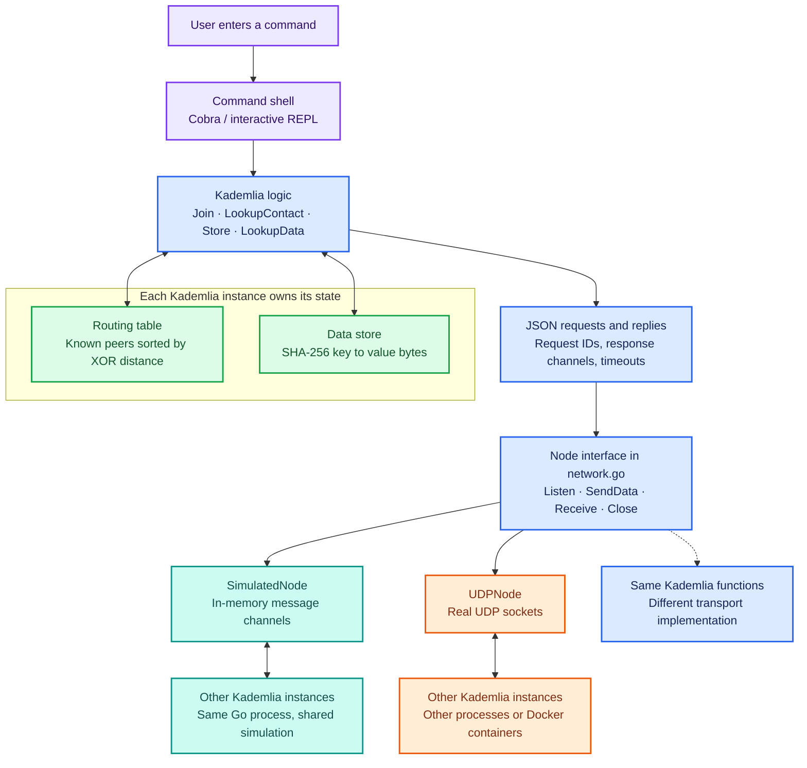
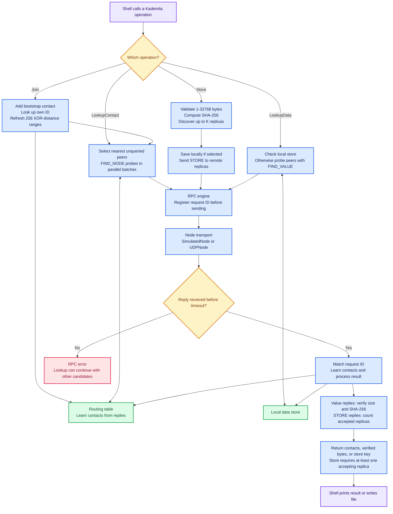
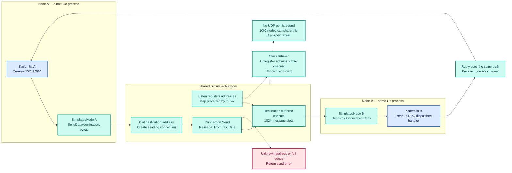
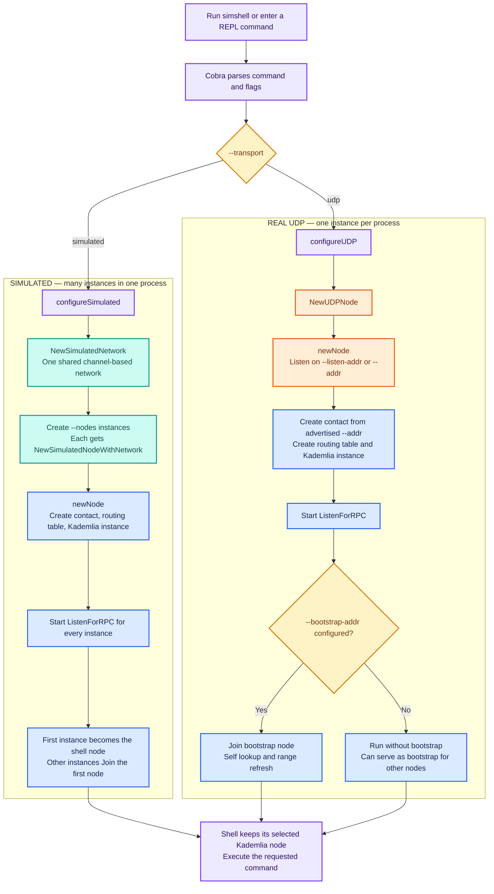
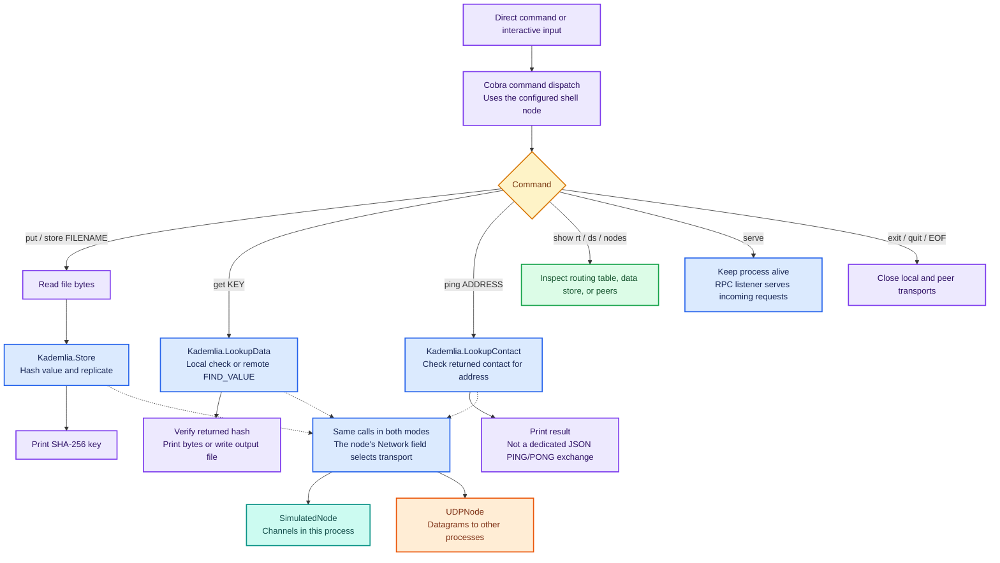

# Kademlia, network, and command-shell architecture

| Color | Responsibility |
| --- | --- |
| Purple | Command shell: `cmd/simshell/main.go` |
| Blue | Kademlia operations and RPC handling |
| Teal | Simulated network in one process |
| Orange | Real UDP networking between processes |
| Green | Routing tables and stored data |
| Yellow | Decisions |
| Red | Errors and timeouts |

## 1. General architecture

[cmd/simshell/main.go](cmd/simshell/main.go) · [kademlia.go](kademlia/kademlia.go) · [network.go](kademlia/network.go)



## 2. How Kademlia functions

[kademlia.go](kademlia/kademlia.go) · [routingtable.go](kademlia/routingtable.go) · [bucket.go](kademlia/bucket.go)



## 3. How the simulated network functions

[network.go](kademlia/network.go): SimulatedNode, SimulatedNetwork, and SimulatedConnection



## 4. How the real UDP network functions

[network.go](kademlia/network.go): UDPNode

```mermaid
flowchart LR
    subgraph A["Process or container A"]
        KA["Kademlia A<br/>JSON RPC and request ID"]:::logic
        UA["UDPNode A<br/>Listen binds a UDP socket"]:::real
        SEND["SendData<br/>WriteToUDP / DialUDP"]:::real
        KA --> UA --> SEND
    end
    WIRE["Real network<br/>One UDP datagram per message"]:::real
    SEND --> WIRE
    subgraph B["Process or container B"]
        UB["UDPNode B<br/>Bound UDP socket"]:::real
        RECV["Receive / ReadFromUDP<br/>64 KiB receive buffer<br/>Copy received bytes"]:::real
        KB["Kademlia B<br/>ListenForRPC dispatches JSON handler"]:::logic
        UB --> RECV --> KB
    end
    WIRE --> UB
    KB --> BACK["Reply datagram<br/>SendData back to A"]:::real
    BACK --> RECEIVEA["UDPNode A receives reply"]:::real
    RECEIVEA --> MATCH["Kademlia A matches request ID<br/>Signals pending response channel"]:::logic
    MATCH --> KA
    WIRE -.-> LOSS["Packet loss / excessive delay"]:::failure
    LOSS --> TIMEOUT["Kademlia RPC deadline expires"]:::failure
    UA -.-> ADDR["Bind address: local socket<br/>Advertised address: how peers reach this node"]:::real
    classDef shell fill:#ede9fe,stroke:#7c3aed,color:#2e1065,stroke-width:2px
    classDef logic fill:#dbeafe,stroke:#2563eb,color:#172554,stroke-width:2px
    classDef sim fill:#ccfbf1,stroke:#0d9488,color:#134e4a,stroke-width:2px
    classDef real fill:#ffedd5,stroke:#ea580c,color:#7c2d12,stroke-width:2px
    classDef data fill:#dcfce7,stroke:#16a34a,color:#14532d,stroke-width:2px
    classDef choice fill:#fef3c7,stroke:#d97706,color:#78350f,stroke-width:2px
    classDef failure fill:#ffe4e6,stroke:#e11d48,color:#881337,stroke-width:2px
```



## 5. How the command shell starts each mode

[cmd/simshell/main.go](cmd/simshell/main.go): configure, configureSimulated, configureUDP, and newNode



## 6. How shell commands invoke Kademlia

[cmd/simshell/main.go](cmd/simshell/main.go): root, repl, put, get, ping, show, and close



## Run either mode

From `labs`:

```powershell
# Simulated: three nodes sharing one in-memory network
go run ./cmd/simshell --transport simulated --nodes 3

# Real: bootstrap node in one terminal
go run ./cmd/simshell --transport udp --addr 127.0.0.1:8000

# Real: second node in another terminal
go run ./cmd/simshell --transport udp --addr 127.0.0.1:8001 --bootstrap-addr 127.0.0.1:8000
```

Open [architecture.html](architecture.html) in a browser to view the colored flowcharts. The browser viewer requires internet access to load Mermaid. GitHub also renders the diagrams directly in this Markdown file.
