# Implementation architecture

These diagrams describe the current Part 1 implementation. Read the general sequence first, then use the file diagrams to locate each responsibility. Arrows in flowcharts mean calls or data flow; arrows in sequence diagrams show runtime message order. A peer represents another instance of the same Kademlia implementation.

Part 2 publication signatures, DNS ownership, version records, and mutable latest pointers are described in [PART2-DESIGN.md](PART2-DESIGN.md) but are not implemented in the current Go code.

## Diagram index

- [General functionality](#general-functionality)
- [File relationships](#file-relationships)
- [kademlia.go: operations and state](#kademliago-operations-and-state)
- [kademlia.go: parallel lookup](#kademliago-parallel-lookup)
- [kademlia.go: joining and refresh](#kademliago-joining-and-refresh)
- [kademlia.go: replication](#kademliago-replication)
- [network.go: transport implementations](#networkgo-transport-implementations)
- [network.go: simulated delivery](#networkgo-simulated-delivery)
- [routingtable.go: routing tree](#routingtablego-routing-tree)
- [bucket.go: contact recency](#bucketgo-contact-recency)
- [contact.go and kademliaid.go: identity and distance](#contactgo-and-kademliaidgo-identity-and-distance)
- [CLI: cmd/simshell/main.go](#cli-cmdsimshellmaingo)
- [Experiments: main.go and resilience.go](#experiments-maingo-and-resiliencego)
- [Deployment and tests](#deployment-and-tests)

## General functionality

Sources: [CLI](cmd/simshell/main.go), [Kademlia operations](kademlia/kademlia.go), [transports](kademlia/network.go). This example stores a file and then retrieves its value by hash. Discovery can require several rounds; each replica has its own listener, routing table, and data store.

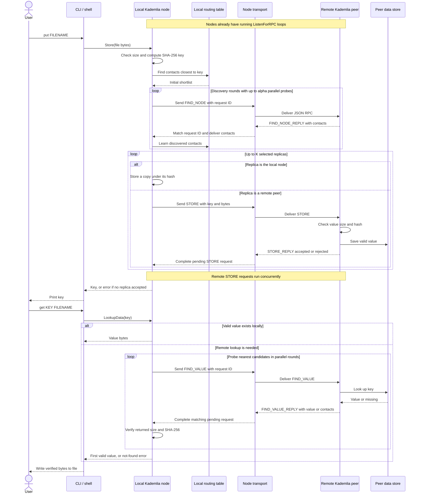

## File relationships

This is a component map rather than a struct-by-struct UML diagram.

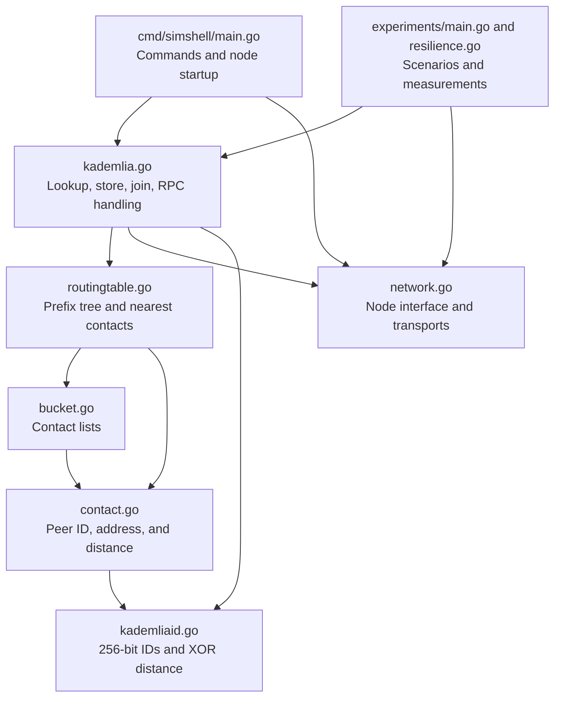

## kademlia.go: operations and state

Source: [kademlia.go](kademlia/kademlia.go). Defaults are `Alpha=3`, `K=10`, RPC timeout 2 seconds, and replication interval 30 seconds. Supported raw value sizes are 1–32,768 bytes.

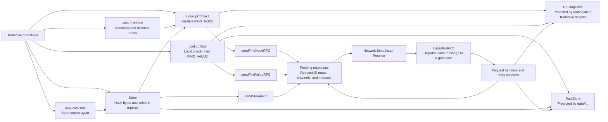

Request handlers answer FIND_NODE, FIND_VALUE, and STORE. Reply handlers update routing knowledge and signal the waiting request channel. `Store` waits for its remote replication attempts and succeeds if at least one selected replica accepted the value; it does not require all K replicas to succeed.

## kademlia.go: parallel lookup

Sources: `lookupContactParallel`, `queryContactsParallel`, and the three `send...RPC` methods in [kademlia.go](kademlia/kademlia.go). Each outgoing request registers its response channel before sending, then waits for the matching reply or a timeout.

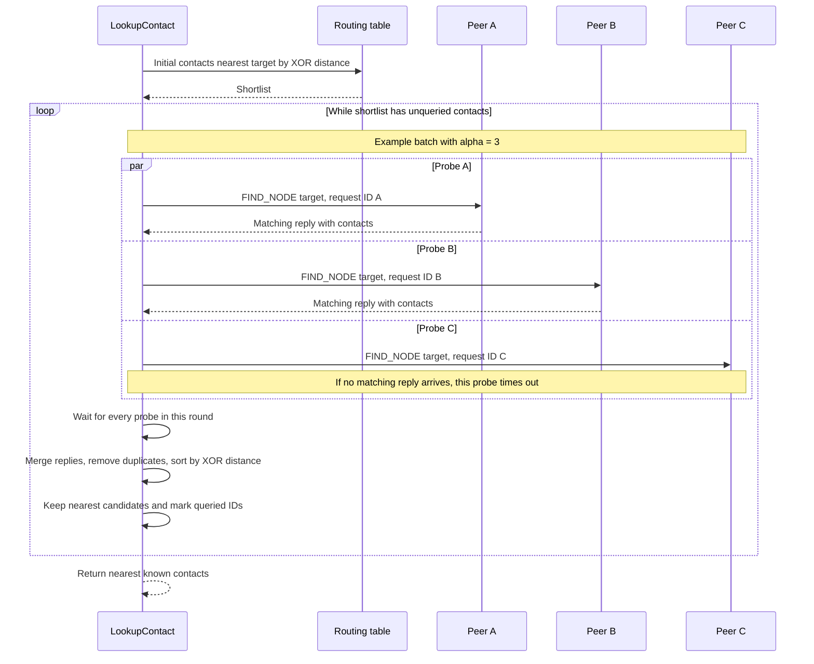

Contact lookup uses strict parallel batches. Failed probes contribute no new contacts, but known candidates can remain in the returned shortlist; a returned contact alone is not proof of a successful liveness check. Value lookup uses FIND_VALUE batches and can return as soon as a valid value is received rather than waiting for every remaining response.

## kademlia.go: joining and refresh

Source: `Join` and `Refresh` in [kademlia.go](kademlia/kademlia.go).

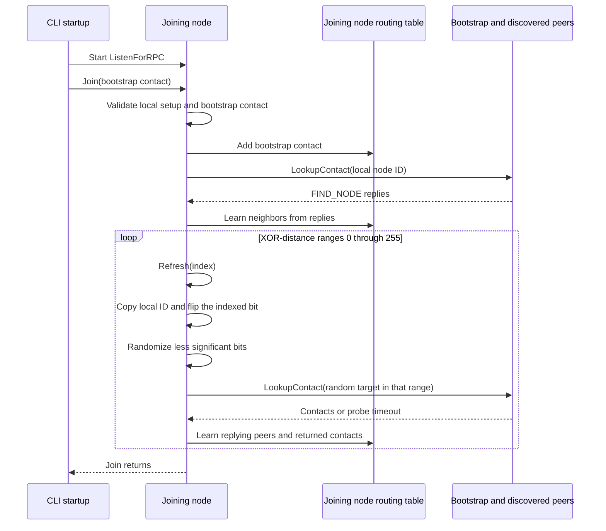

Refresh indices here identify 256 XOR-distance ranges. They are not the dynamically allocated leaf indices used by the routing tree's inspection methods. `Join` validates configuration but currently does not propagate failed lookup probes, so its nil result does not guarantee a responsive bootstrap.

## kademlia.go: replication

Source: `StartReplication` and `ReplicateData` in [kademlia.go](kademlia/kademlia.go).

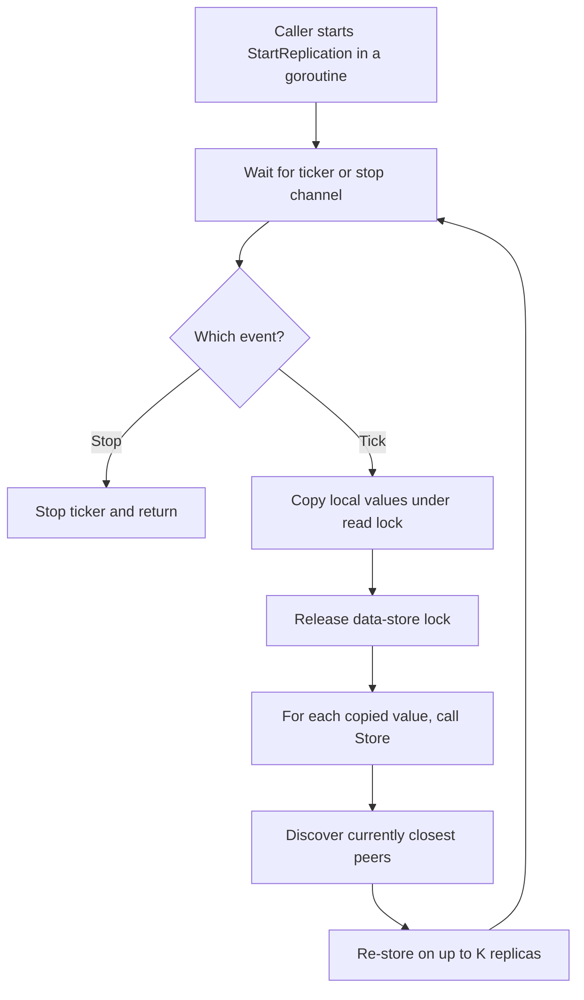

The replication functions exist, but the current CLI and experiment startup paths do not call `StartReplication`. The diagram shows how an explicit caller activates it. Values do not expire.

## network.go: transport implementations

Source: [network.go](kademlia/network.go). Kademlia uses the `Node` interface to exchange JSON RPC bytes without depending on a particular transport.

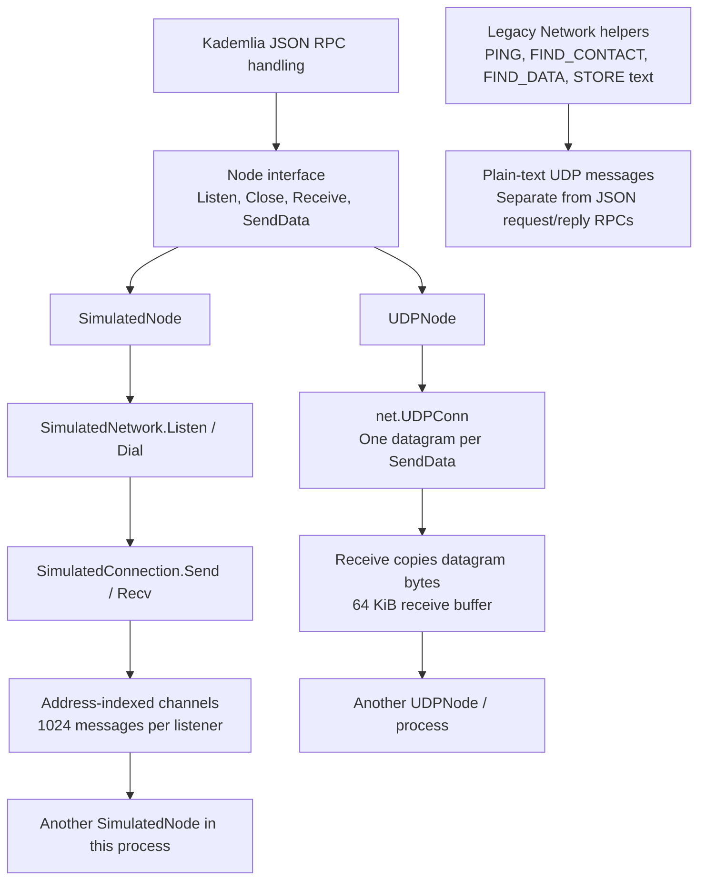

`SimulatedNetwork` protects its listener map with a mutex. Delivery to a full queue returns an error instead of blocking. Closing a listener unregisters its address and closes its channel, allowing the receive loop to terminate. `UDPNode` binds sockets and uses read/write operations guarded by its connection-state mutex. The legacy standalone `Listen` helper has a 1 KiB buffer and prints text; the JSON RPC listener uses `UDPNode.Receive` instead.

## network.go: simulated delivery

This is the same simulation used by the 1,000-node test; addresses identify in-memory listeners rather than real bound UDP ports.

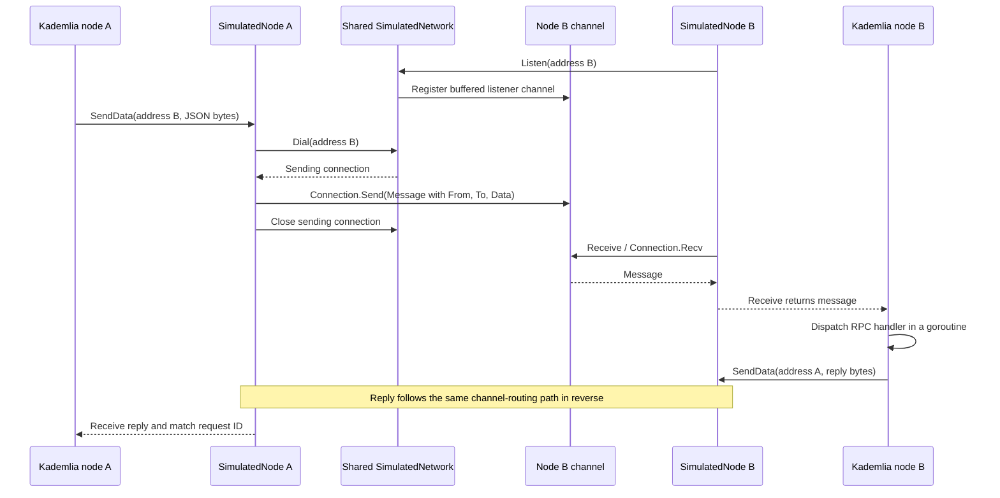

## routingtable.go: routing tree

Source: [routingtable.go](kademlia/routingtable.go). The default branching parameter is `b=1`. Only a full leaf on the local node's prefix path may split. Leaf capacity is fixed at 20, independently of Kademlia's configurable replication factor `K`.

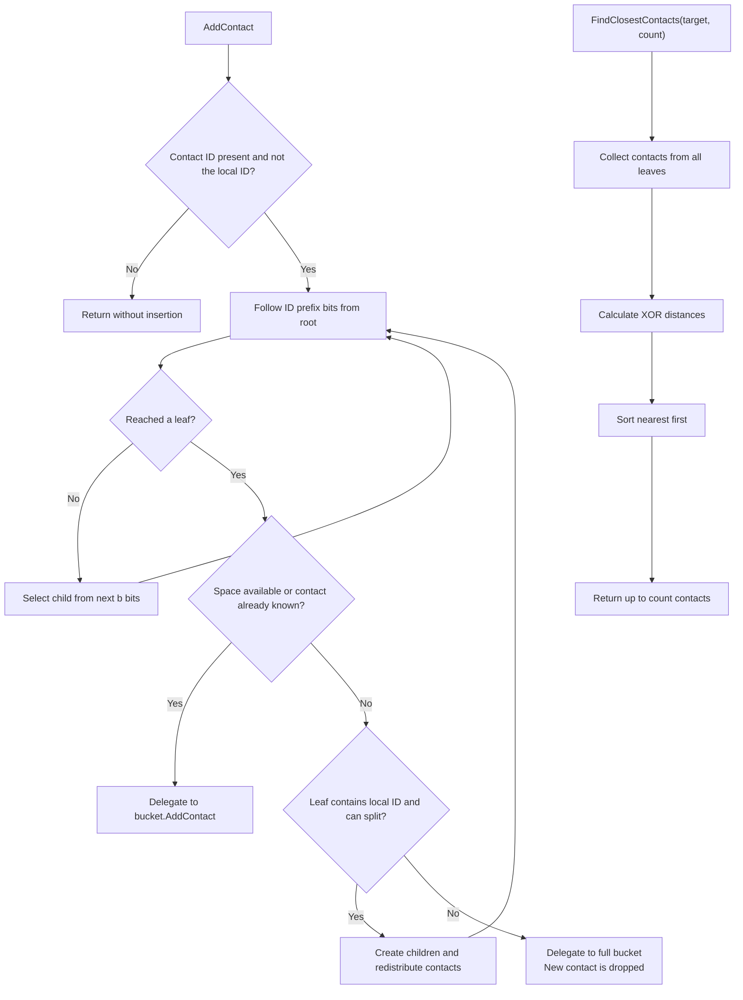

Nearest-contact queries currently collect and sort all stored contacts rather than performing a pruned nearest-neighbor tree traversal. Kademlia's routing helpers provide synchronization; `RoutingTable` itself does not acquire locks.

## bucket.go: contact recency

Source: [bucket.go](kademlia/bucket.go). The front of the linked list is the most recently seen contact.

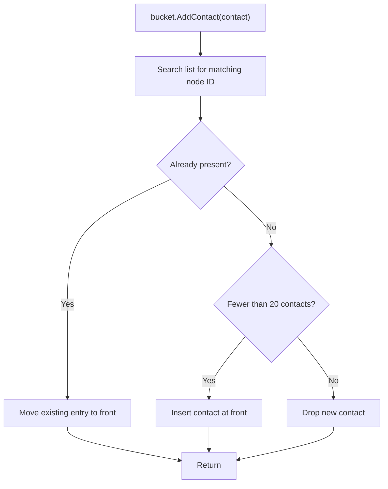

The current bucket implementation does not ping or evict the least recently seen contact when full. Moving an existing entry updates its recency but does not replace its stored address.

## contact.go and kademliaid.go: identity and distance

Sources: [contact.go](kademlia/contact.go), [kademliaid.go](kademlia/kademliaid.go), and the CLI's `hashID` helper. A `Contact` pairs a 256-bit ID with a network address and a calculated distance.

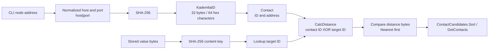

ID hashing is chosen by the caller: the CLI uses `host|port`, while the experiment helper hashes its generated address string. `NewKademliaID` validates and decodes a 64-character hex identifier; it does not hash its input.

## CLI: cmd/simshell/main.go

Source: [cmd/simshell/main.go](cmd/simshell/main.go). Cobra handles both direct invocation and commands entered in the interactive shell.

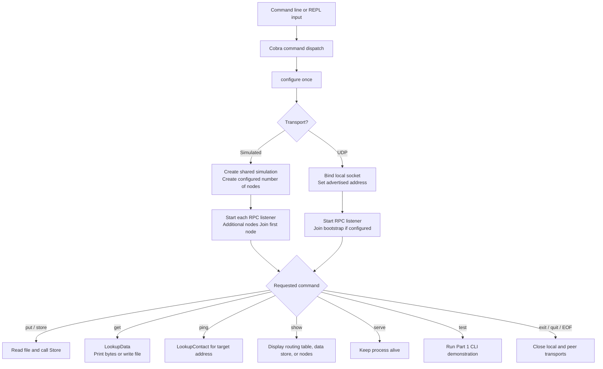

The `test` command creates its own demonstration network and bypasses normal startup configuration. `ping` currently checks the contact-lookup result rather than exchanging a dedicated JSON PING/PONG RPC. The REPL tokenizes input with `strings.Fields`, so it does not interpret shell quoting for filenames containing spaces.

## Experiments: main.go and resilience.go

Sources: [experiments/main.go](experiments/main.go), [experiments/resilience.go](experiments/resilience.go), and [experiment documentation](experiments/README.md).

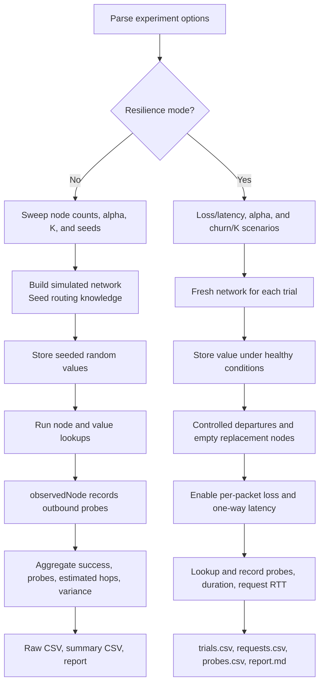

The wrappers delegate to the existing `network.go` simulation. `observedNode` counts relevant FIND_NODE/FIND_VALUE sends. `impairedNode` silently drops selected packets or schedules delayed delivery, including replies. Churn is a simulated exposure between storage and lookup, not continuous node departures during the lookup. Estimated hops are `ceil(probes/alpha)`; they are not measured routing path lengths.

## Deployment and tests

Sources: [docker-compose.yml](docker-compose.yml), [kademlia_test.go](kademlia/kademlia_test.go), [value_size_test.go](kademlia/value_size_test.go), and [.github/workflows/ci.yml](../.github/workflows/ci.yml).

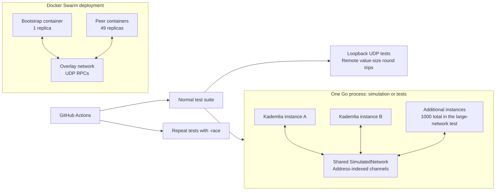

Each node owns its state; the simulation shares the transport fabric, not the routing tables or data stores. The 1,000-node test keeps all instances live, verifies a request/reply ring, then stores and retrieves a value from a non-replica. Docker's replica count is configured for `docker stack deploy`; ordinary Compose does not establish the Swarm topology described here.
